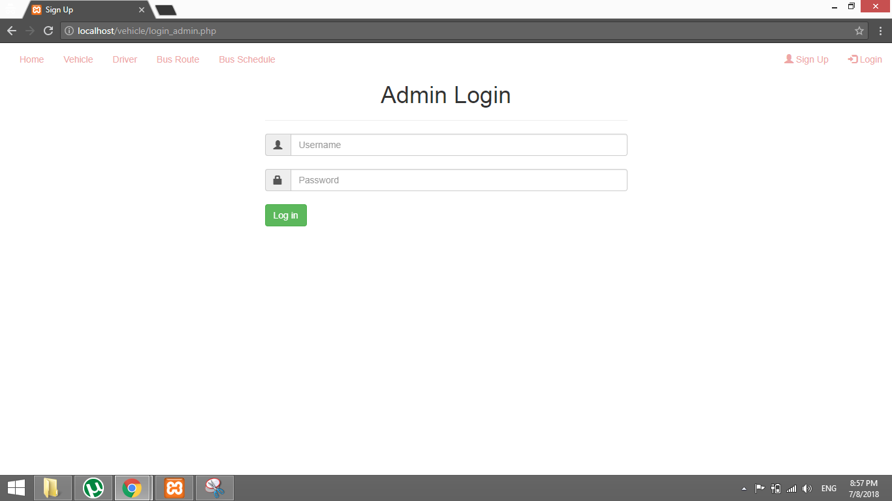
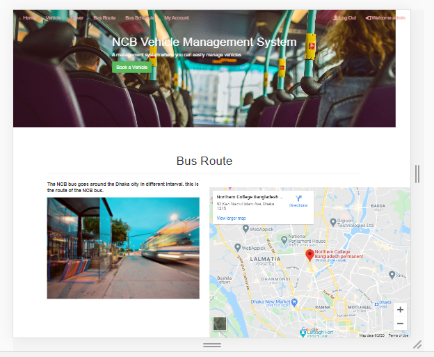
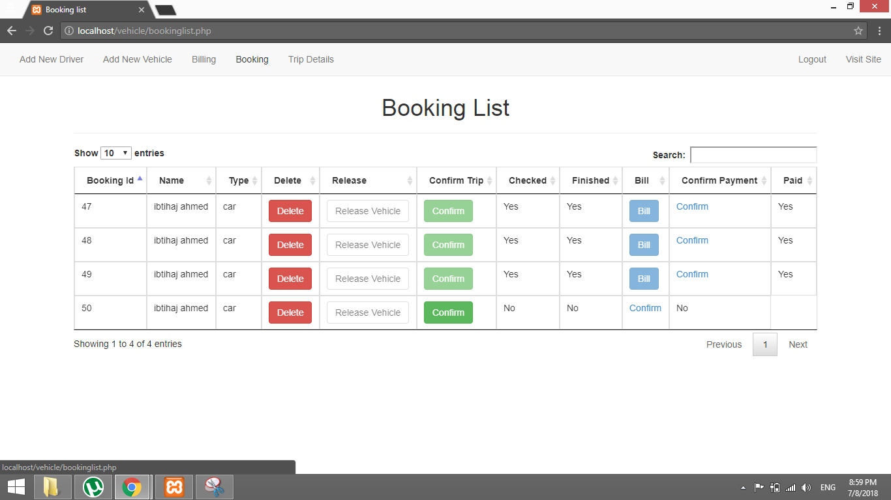
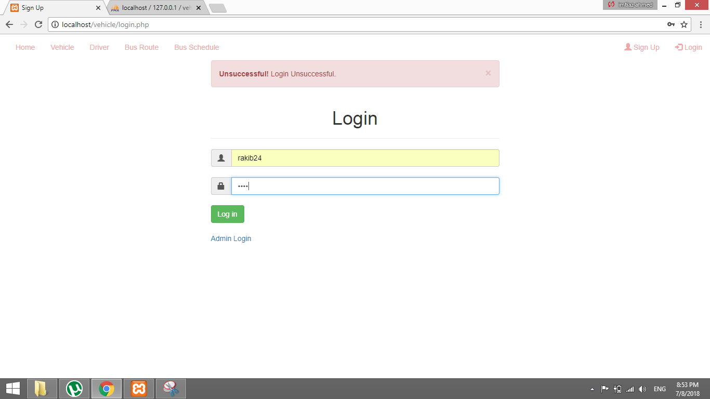
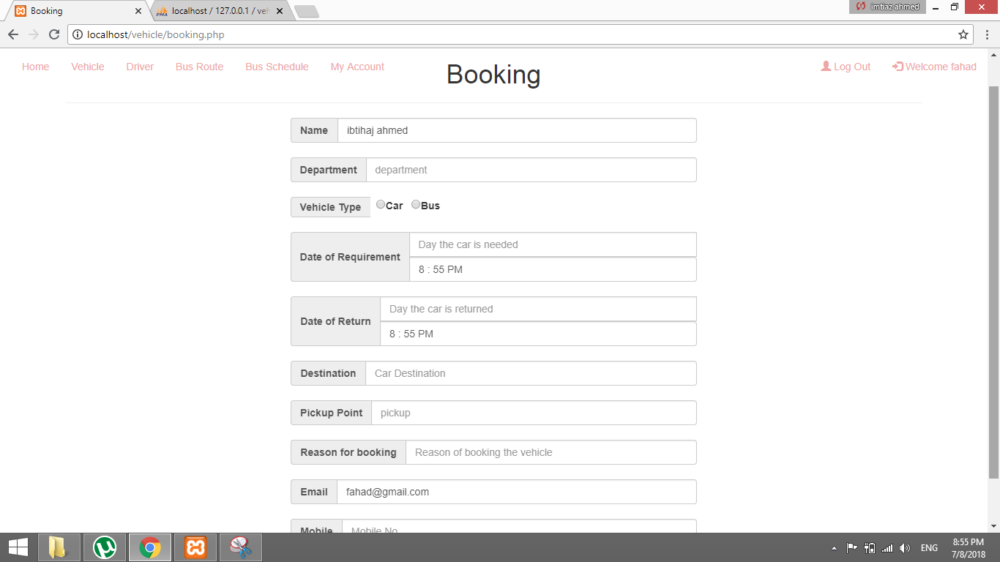
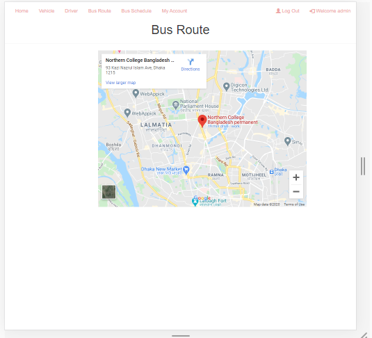

# Vehicle-management

Admin: username: admin pass: admin

User: username: username pass: user

Frontend : html,css,Bootstrap, jquery;
Backend : php , mysql

Admin can manage driver, vehicle, booking , billing, trips details, schedule .

user can see vehicl, driver, route, schedeule,his/her account and billing info.
user can book a vehicle for rent.

 -----------------------------Screenshoot------------------------------------------

